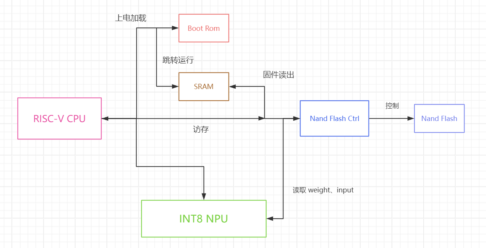
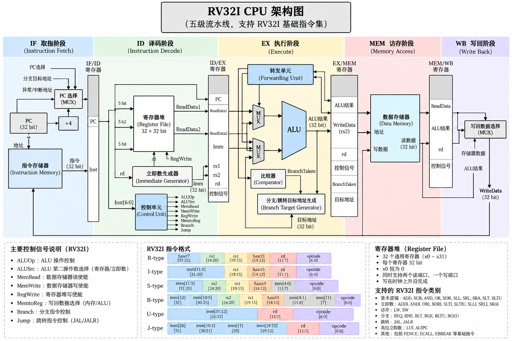
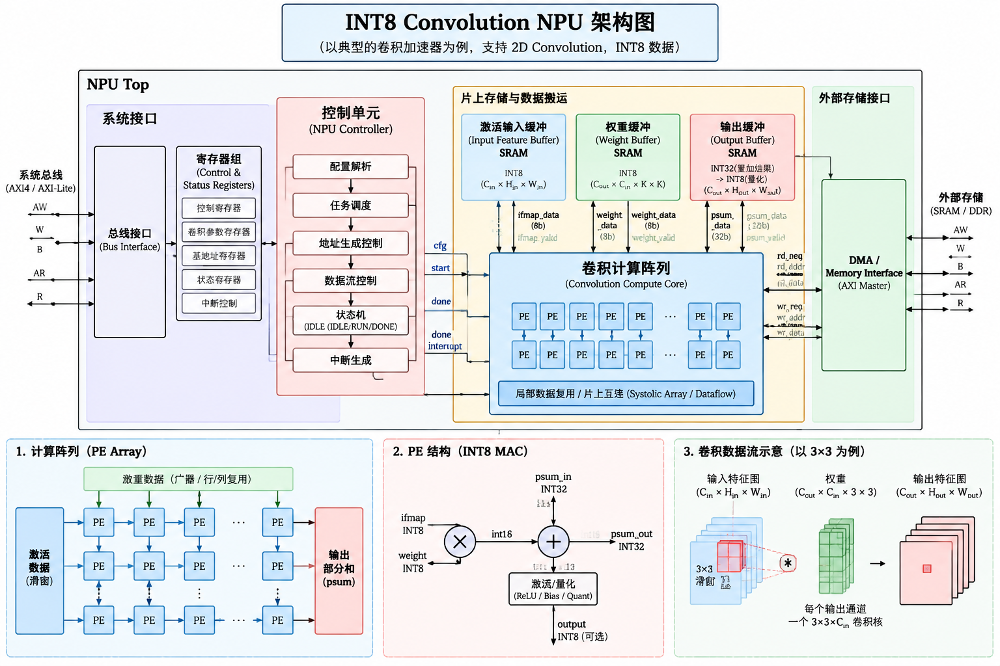

> \# Riscv-Boot-NPU-nandFlash

这是一个自定义的工程，目标是

# 基于 RISC-V 与 INT8 NPU 的自启动 AI SoC

## 项目简介：

    Boot code 放置于 Boot Rom，基于 RV32I 五级流水 CPU，上电运行 boot code，通过 nand Flash 控制器，将 Firmware 读取至 SRAM，CPU 跳转是 SRAM开始运行固件，进而对 INT8 NPU 配置权重与特征图地址，启动卷积计算，并返回结果。

## 最终目标：

  实现前端设计：

1. RV32I 五级流水 CPU

2. Boot Rom 程序运行

3. NAND Flash 控制器

4. 跳转 SRAM 固件运行

5. INT8 卷积 NPU 

6. 并完成验证、综合、STA 与 PPA 优化。

32I 5-stage pipelined CPU with custom instructions and a near-memory convolution accelerator.

1. SoC 总架构
   总架构图如下：
   

2、CPU 架构（AI 生图）

Control Hazard 方案：

    由 ID 解码当前指令，如遇到 Branch，JAL，JALR 就停止 PC next，stall 至 EX 决断出 redirect\_pc 再继续 fetch instruction

Data Hazard 方案：

    采用 forwarding，对于来不及 forwarding 的，以及 WAW，WAR 均 stall 住，发 bubble     

3、Memory

系统内存在三类存储，分别介绍：

    a. Boot ROM：很小，只负责存放 Bootcode，用于上电启动，由于只是前端设计，所以仅 RTL 模拟 ROM 行为，Bootcode 提前写进去，无实际物理部件

    b. SRAM：主要用于存储 固件，Runtime Data，Weight，NPU result 等，即 数据&指令 存储器

    c. NAND：RTL 模拟非易失存储行为模型，提前写入Firmware Image、Weight、Input Data ，不设计其内的 物理 cell，ECC，结构等

                    但会设计 Flash Controller RTL，提供 AXI 接口，处理指令仲裁，CDC 等

4、NPU 架构(AI 生成，后面再改)

5、Boot flow

系统上电 -> Reset -> PC 从 Boot ROM 开始运行 -> 通过 Nand Flash Controller search Firmware Code -> 将 search 到的固件读取到 SRAM -> CPU 跳转到 SRAM 开始运行 -> 配置引导 NPU（weight、input、output address，size）-> NPU 流水线读取 nand flash 进行 INT8 Convolution -> 写回 output

6、验证

LEVEL1：分模块验证，确保各子模块功能完好，实现正确，符合设计

LEVEL2：验证 CPU ，是否支持所有预定指令，数据冒险，控制冒险，是否符合既定的 flow

LEVEL3：验证 NPU 数据走向，计算是否正确，与 Python 同模型计算结果对比

LEVEL4：验证 Nand flash 仲裁 cmd 是否准确，符合预期，能否解决读写冲突，多主一丛问题，read write compare 以及 CDC

LEVEL5：SoC End-to-End，上电自启动，testbench 仅提供复位，验证程序自启&运行流程是否符合设计

7、ASIC flow

分模块综合（仅 CPU&NPU），走完整前端 flow，RTL Lint ，Simulation，Synthesis，STA，PPA，

工具：VS CODE，Modelsim，DC，Primetime

标准单元：smic13\_tt.db （中芯国际，0.13um Typical-Typical）

8、性能指标

