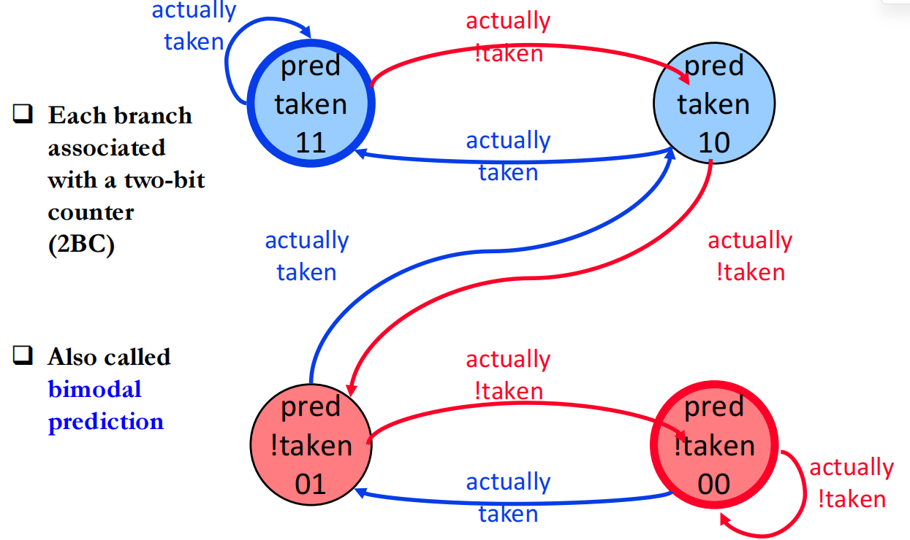
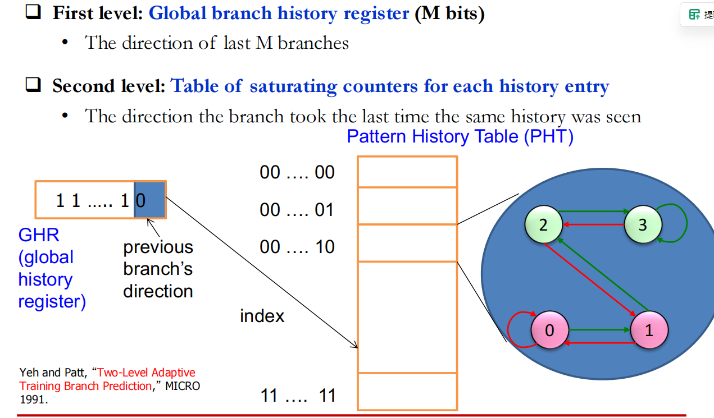
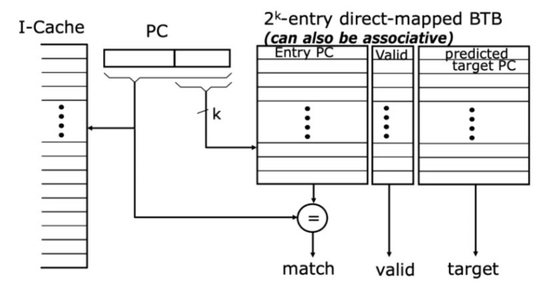
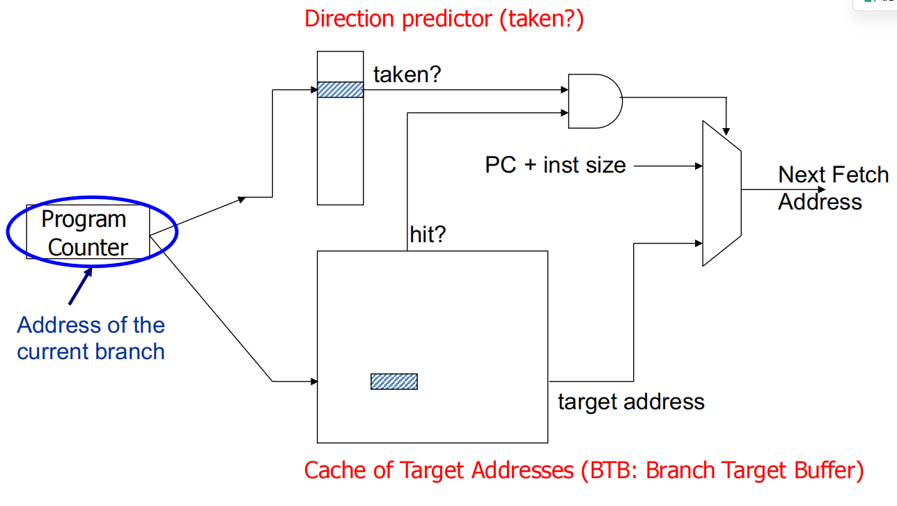
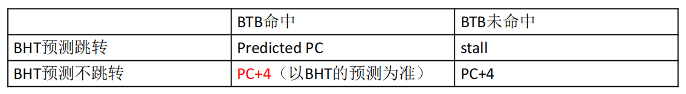

# 一、计算机体系结构

## CPU 处理指令有五个阶段：

1. IF 取指令，根据条件，决定 PC 是多少，根据 PC 去 instruction mem 取指令，并计算 PC + 4

2. ID 译码，将指令拆分，获取 opcode，rd，立即数等，并读寄存器

3. EXE 执行，用 ALU 进行加，乘，比较等计算

4. MEM 访存，就读写数据存储器，LW SW 会操作这个

5. WB 写回，将 ALU 结果，或者 读存储器的结果写回 寄存器

## CPU 执行方式：

单周期处理器：一条指令，从取指到执行完成，全部在一个时钟周期内搞定。

多周期处理器：每个周期只执行一个阶段，但同一时刻只执行一条指令

流水线处理器：一条指令仍然分多个阶段、多个周期执行，但允许多条指令同时处于不同阶段

in order 流水线处理器：指令顺序执行，但如果某条指令在某个阶段处理的特别久，后续指令就只能 stall 住等着，但好处是，在经典单发射五级顺序流水中，寄存器读取和写回发生在固定流水阶段，且指令保持顺序推进，因此 WAR/WAW 不会形成需要额外处理的 hazard

out of other 流水线处理器：指令可以乱序执行，比如，如果有 某条老指令因为操作数未就绪、Cache Miss、长延迟执行单元等原因迟迟不能执行，而后面的独立指令已经 Ready，所以后续没有依赖，就没必要等它，可以先完成执行，但是会引入 WAW 和 WAR 的依赖，这需要新的算法解决

## forwarding：

是为了解决，如下一个指令要用到上一个指令的结果，那它其实不用等到写回，再读寄存器，可以ALU 结束直接 forward 到 exe 的输入

## 打分板：

为乱序执行提供一种方法，但是无法解决依赖，仍是 stall，没有像 Tomasulo 那样通过寄存器重命名消除 WAR/WAW

## Tomasulo：

能够解决WAW 和 WAR，原理是通过保留站，记录 tag 和 广播，以产生结果的保留站标识为tag，如果有想要读取某个值，来自这个计算单元，那么就记录这个 tag，等到它算好了，会广播结果，匹配上 Tag 的就会更新对应的值，如果有WAW，就直接更新成新的 tag，如果有 WAR ，可以直接将数据读到保留栈，不会阻塞后续写，但是就会出现没有按照顺序写回的问题

## ROB：

同样保存 tag，广播时会更新值，但不立即commit，而是乱序完成、顺序提交，同时读取某一个寄存器的值时，既要看寄存器，又要看 ROB，因为最新的值可能在 ROB 里

## 物理寄存器重命名：

物理寄存器比架构寄存器远远多出，维护 Rename Map Table & Free List，给每个要写的架构寄存器分配新的物理寄存器，并记录上一次分配的物理寄存器，顺序 commit 的时候，当本次物理寄存器的结果计算出来了，就把上次的旧物理寄存器释放，改成新的映射，来解决写后写，和读后写（因为虽然是同一个寄存器，但实际写的已经是另一个被 mapping 的物理寄存器了），并且完成实现了顺序提交，有异常时，按照已经 commit 的恢复现场（有些架构选择保存旧映射，异常时回滚旧映射，有些选择另外维护一份 commit table 展示给架构）

## 分支预测：

要做到分支，关键是掌握三个信息：

1、当前 instruction 是不是 分支指令

2、跳转的方向（PC+4 还是 guess PC）

3、跳转的 redirect PC addr

所以如何得到这三个信息呢：

### 1、通过 pre decode，在 IF 阶段可以初步 decode opcode，判断出当前 instruction 是否为分支指令

     通过编译器讲分支指令 标记一个 branch meta bit

     如果 BTB 中能找到 match 的指令，也说明是一个分支指令

### 2、只讲 dynamic direction predict

    a、**Last time predictor** 就是上一次是 taken，这次就猜 taken，反之亦然

    b、2 bit 饱和计数器，11 -> 强 taken，10 -> 弱 taken，01 -> 弱 !taken ，00 -> 强 !taken，会降低 N->T，T->N 的速度，有个缓冲

    c、两级 GBR（global branch prediction）
    GHR(global history register) 记录全局 taken 的历史，以 GHR 为索引，到 PHT（Pattern History Table）中找对应的栏位，每个栏位都保存着一个2bit饱和计数器，来指引 taken or !taken，同时每次的 actual result 指引更新对应的 饱和计数器以及 GHR

d、两级 Gshare Branch Prediction
与 GBR 相比，区别是 不仅仅通过 GHR 来索引Pattern History Table，而是通过 GBR XOR PC 的结果来索引，这样的结果包含了更多的信息

e、(m, n)关联预测器
以最近 M 个分支的执行结果为索引，找到对应的 predictor，再以 PC 低k位为索引，找到特定的 n bit 饱和计数器，来预测跳转方向

f、后面还有 Two-Level Local History Branch Predictor，**锦标赛预测器**，Perceptrons predictor，TAGE 等办法

### 3、BTB （Branch Target Buffer）

每行保存一个分支指令，以及预测的 PC（为曾经发生跳转的指令地址），以指令后 k 位为索引，可以设计直接索引到 PC 进行 match，也可以所引到一组表项，再进一步与表项中的 PC 进行 match，match 上了就取出预测地址

整体结构：

