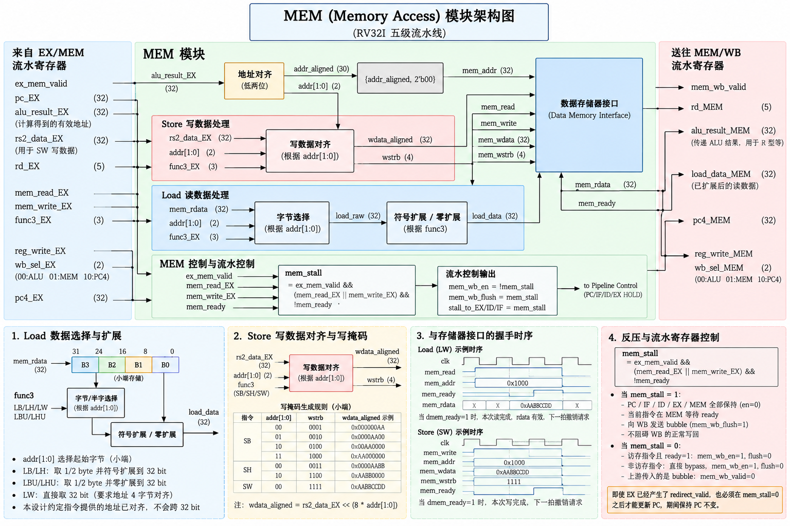

# 四、MEM 架构



## 1、load flow

我们每次都从 sram 拿 32 bit word （4字节对齐），（SRAM 采用小端），但 load 指令有四种：

```
func3
000    LB   读  8 bit → 符号扩展到32 bit
001    LH   读 16 bit → 符号扩展到32 bit
010    LW   读 32 bit

100    LBU  读  8 bit → 零扩展到32 bit
101    LHU  读 16 bit → 零扩展到32 bit
```

我们要维护一个 `addr[1:0]`，即读地址的低两位，我们通过 {addr[31:2],2'b00} 读 32 位数据，再根据`addr[1:0]`来选择从这 32 bit 中的哪个开始截取，LB 截取 1 byte，LH 截取 2 byte，LW 截取 4 byte，之后再进行对应的 符号扩展或者零扩展

这样的方式会有一个问题，比如 LW 读地址 0x02，这样实际上就是读 0x02 - 0x05 这四个字节，它们是跨 32bit 的，这就需要 mem 读两次再组合起来，为了方便设计，我们约定指令带的地址均为对应对齐的，就是说LB 带的地址为1字节对齐，LH 带的地址为2字节对齐，LW 带的地址为4字节对齐，这样到了 Mem 这里，就不会出现需要读两次再拼接的情况了

而如何判断要操作的是哪种 load 指令呢，就要根据 func3 来判断，


## 2、store flow

```
func3
000    SB → 写低  8 bit
001    SH → 写低 16 bit
010    SW → 写   32 bit
```

由于要同时兼容这三种写法，所以要维护一个 dmem\_wstrb，4 bit 用于告诉 sram 哪个 byte 是有效的

比如想向 addr 0x02 SH 0x4455，那么要先补成 32 bit，0x44550000，然后 dmem\_wstrb = 4'b1100，这样sram 收到后就会截取高2 byte 覆盖高两字节


## 3、mem ctrl flow

### a、首先是 mem 与  Interconnect 的握手协议：

简单定义 ready 信号，默认为 0，信号立起的含义是当前请求完成了

当 mem 发起读写请求时，ready为0，代表busy，access 并未发生，mem 要保持请求信号

当 ready 拉高的时候，代表 rdata 送出，或者 write data 写入，在当拍结束，mem 要撤掉请求信号，或者发起下一请求

```
// CPU → Interconnect
dmem\_read
dmem\_write
dmem\_addr
dmem\_wdata
dmem\_wstrb

// Interconnect → CPU
dmem\_ready
dmem\_rdata
```

真正 transaction 完成的条件是 (dmem_read || dmem_write) && dmem_ready

比如 LW：

```
Cycle       N        N+1       N+2       N+3

dmem\_read   1         1         1        0
addr       1000      1000      1000       0
ready       0         0         1         0
rdata       X         X       ABCD        0
```

### b、反压逻辑

由于 mem 访存需要多周期才能执行完成，当前指令在 Mem 等 ready 的时候，全流水线应该 hold，即反压 **EX ID   IF PC，但不会影响写回，所以要 hold 前流水，并且不能阻碍 WB 的执行，需要向 WB 传 bubble，当 ready 后，所有流水 refresh**

但 Mem 不是所有指令都会 busy 的，对于普通的 R type 指令，在 mem 都是 bypass，所以要 busy 的条件是

```
mem_stall =
    ex_mem_valid &&
    (ex_mem_mem_read || ex_mem_mem_write) &&
    !dmem_ready;

if(mem_stall)begin
    pc_en = 0;
    if_id_en = 0;
    id_ex_en = 0;
    ex_mem_en = 0;
end
```

有一个情况是 当前正在访存，下一条指令是 branch，已经在 EX 决断出 redirect_pc 并且给出 redirect_valid 了，但此时也不能跳转，PC 要仍然 hold old PC，等到解 hold 的时候，redirect_valid 再给出，PC 再更新


## 4、MEM/WB

需要传递的寄存器

```
mem_wb_valid

mem_wb_alu_result
mem_wb_load_data
mem_wb_pc4

mem_wb_rd

mem_wb_reg_write
mem_wb_wb_sel
```

mem_wb_wb_sel ：选择写回的数据来自哪里

```
WB_ALU → mem_wb_alu_result
WB_MEM → mem_wb_load_data
WB_PC4 → mem_wb_pc4
```

并且和之前的模块类似，控制信号为

```
mem_wb_en
mem_wb_flush
```

如果当前指令是访存指令，当 `dmem_ready`的时候，访存才完成，才 mem_wb_en = 1，mem\_wb\_flus = 0，否则
mem\_wb\_flus = 1，向 WB 传 bubble

不是访存指令直接 bypass ，mem_wb_en = 1，mem\_wb\_flus = 0

同样，如果上游传了 bubble，直接 mem\_wb\_valid \<= ex\_mem\_valid;   // = 0

