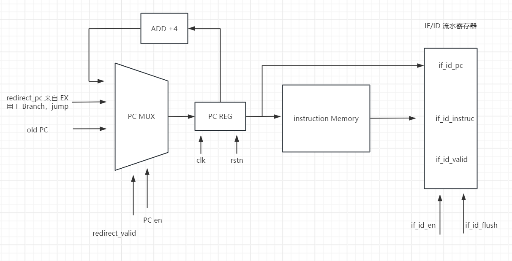
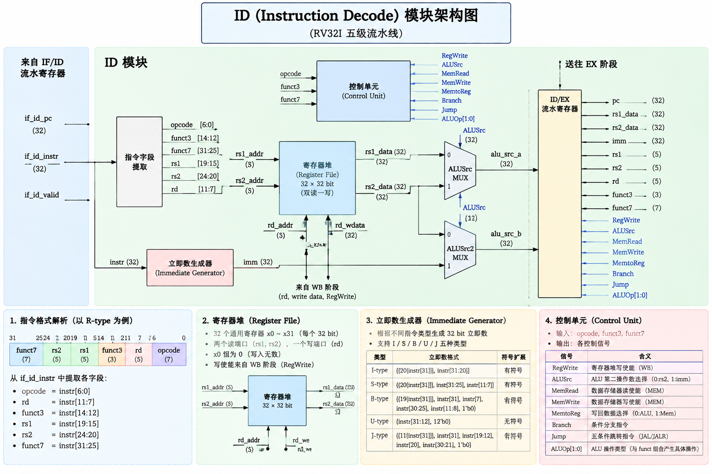
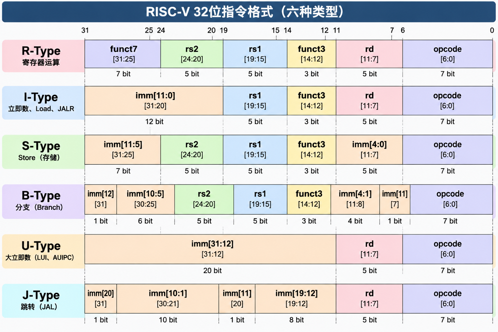
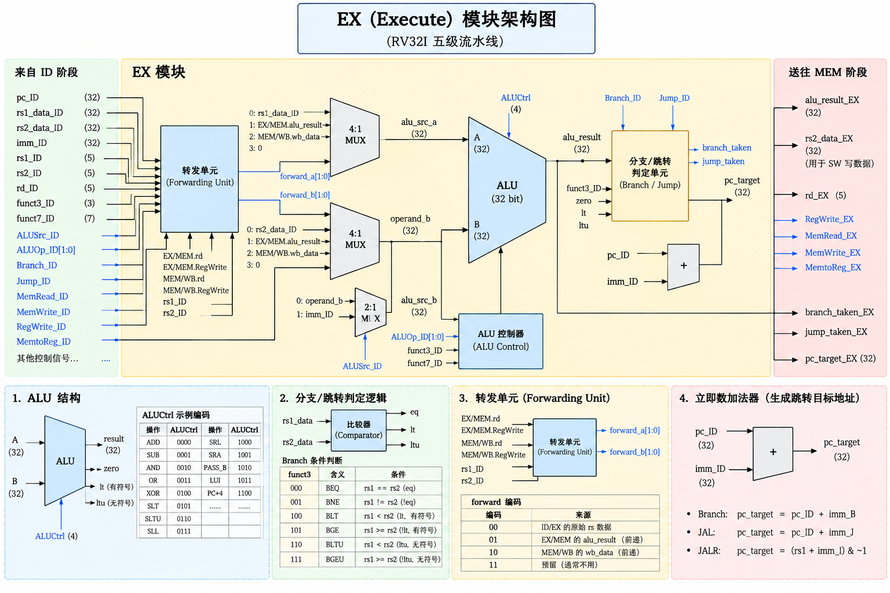
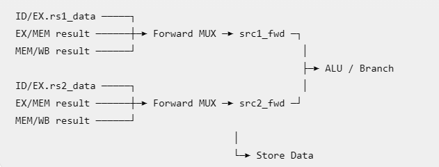
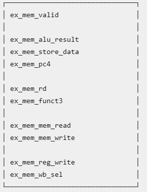

# 一、计算机体系结构

## CPU 处理指令有五个阶段：

1. IF 取指令，根据条件，决定 PC 是多少，根据 PC 去 instruction mem 取指令，并计算 PC + 4

2. ID 译码，将指令拆分，获取 opcode，rd，立即数等，并读寄存器

3. EXE 执行，用 ALU 进行加，乘，比较等计算

4. MEM 访存，就读写数据存储器，LW SW 会操作这个

5. WB 写回，将 ALU 结果，或者 读存储器的结果写回 寄存器


## CPU 执行方式：

单周期处理器：一条指令，从取指到执行完成，全部在一个时钟周期内搞定。

多周期处理器：每个周期只执行一个阶段，但同一时刻只执行一条指令

流水线处理器：一条指令仍然分多个阶段、多个周期执行，但允许多条指令同时处于不同阶段

in order 流水线处理器：指令顺序执行，但如果某条指令在某个阶段处理的特别久，后续指令就只能 stall 住等着，但好处是，在经典单发射五级顺序流水中，寄存器读取和写回发生在固定流水阶段，且指令保持顺序推进，因此 WAR/WAW 不会形成需要额外处理的 hazard

out of other 流水线处理器：指令可以乱序执行，比如，如果有 某条老指令因为操作数未就绪、Cache Miss、长延迟执行单元等原因迟迟不能执行，而后面的独立指令已经 Ready，所以后续没有依赖，就没必要等它，可以先完成执行，但是会引入 WAW 和 WAR 的依赖，这需要新的算法解决


## forwarding：

是为了解决，如下一个指令要用到上一个指令的结果，那它其实不用等到写回，再读寄存器，可以ALU 结束直接 forward 到 exe 的输入

## 打分板：

为乱序执行提供一种方法，但是无法解决依赖，仍是 stall，没有像 Tomasulo 那样通过寄存器重命名消除 WAR/WAW

## Tomasulo：

能够解决WAW 和 WAR，原理是通过保留站，记录 tag 和 广播，以产生结果的保留站标识为tag，如果有想要读取某个值，来自这个计算单元，那么就记录这个 tag，等到它算好了，会广播结果，匹配上 Tag 的就会更新对应的值，如果有WAW，就直接更新成新的 tag，如果有 WAR ，可以直接将数据读到保留栈，不会阻塞后续写，但是就会出现没有按照顺序写回的问题

## ROB：

同样保存 tag，广播时会更新值，但不立即commit，而是乱序完成、顺序提交，同时读取某一个寄存器的值时，既要看寄存器，又要看 ROB，因为最新的值可能在 ROB 里

## 物理寄存器重命名：

物理寄存器比架构寄存器远远多出，维护 Rename Map Table & Free List，给每个要写的架构寄存器分配新的物理寄存器，并记录上一次分配的物理寄存器，顺序 commit 的时候，当本次物理寄存器的结果计算出来了，就把上次的旧物理寄存器释放，改成新的映射，来解决写后写，和读后写（因为虽然是同一个寄存器，但实际写的已经是另一个被 mapping 的物理寄存器了），并且完成实现了顺序提交，有异常时，按照已经 commit 的恢复现场（有些架构选择保存旧映射，异常时回滚旧映射，有些选择另外维护一份 commit table 展示给架构）

## 分支预测：

要做到分支，关键是掌握三个信息：

1、当前 instruction 是不是 分支指令

2、跳转的方向（PC+4 还是 guess PC）

3、跳转的 redirect PC addr

所以如何得到这三个信息呢：

### 1、通过 pre decode，在 IF 阶段可以初步 decode opcode，判断出当前 instruction 是否为分支指令

     通过编译器讲分支指令 标记一个 branch meta bit

     如果 BTB 中能找到 match 的指令，也说明是一个分支指令

### 2、只讲 dynamic direction predict

    a、**Last time predictor** 就是上一次是 taken，这次就猜 taken，反之亦然

    b、2 bit 饱和计数器，11 -> 强 taken，10 -> 弱 taken，01 -> 弱 !taken ，00 -> 强 !taken，会降低 N->T，T->N 的速度，有个缓冲


    c、两级 GBR（global branch prediction）
    GHR(global history register) 记录全局 taken 的历史，以 GHR 为索引，到 PHT（Pattern History Table）中找对应的栏位，每个栏位都保存着一个2bit饱和计数器，来指引 taken or !taken，同时每次的 actual result 指引更新对应的 饱和计数器以及 GHR


d、两级 Gshare Branch Prediction
与 GBR 相比，区别是 不仅仅通过 GHR 来索引Pattern History Table，而是通过 GBR XOR PC 的结果来索引，这样的结果包含了更多的信息

e、(m, n)关联预测器
以最近 M 个分支的执行结果为索引，找到对应的 predictor，再以 PC 低k位为索引，找到特定的 n bit 饱和计数器，来预测跳转方向

f、后面还有 Two-Level Local History Branch Predictor，**锦标赛预测器**，Perceptrons predictor，TAGE 等办法


### 3、BTB （Branch Target Buffer）

每行保存一个分支指令，以及预测的 PC（为曾经发生跳转的指令地址），以指令后 k 位为索引，可以设计直接索引到 PC 进行 match，也可以所引到一组表项，再进一步与表项中的 PC 进行 match，match 上了就取出预测地址


整体结构：


# 二、IF 架构设计

架构图：




## 1、PC MUX -> reg

来源：a、PC + 4 正常执行时，走这条路

          b、来自 EX 的 redirect PC，用于 branch，jump 指令等

          c、old PC：对于 stall（由于后续模块未执行完，当前指令不能进入ID， ID/IF 和 PC 均需要 hold），和 flush 的情况（ID 解析出 branch 和 jump 指令等，在 EX 结束前，后面不能产生有效指令，因此 PC 要 hold，ID/IF 要 bubble）

控制信号：当 redirect_valid 时，说明 PC 需要跳转至来自 EX 的新地址，并且寄存一拍，if_id_en 立起，读取的新指令进入 IF/ID 

                 当 !redirect_valid & PC_en ，说明是正常流程，选择 PC+4

                 当 !redirect_valid & !PC_en，说明是 stall 或者 flush，PC 需要hold，选 old PC，同时对应着 if_id_en、if_id_flush 不同的值


## 2、instruction Memory

输入：PC & readen

输出：instruction body


## 3、IF/ID pipeline reg

寄存 PC 用于后续 ex 做计算会用到，寄存 instruction body 用于 ID decode

控制信号：

| if_id_enable | if_id_flush | 动作      | 对应               |
| ------------ | ----------- | ------- | ---------------- |
| 0            | 0           | 保持      | stall，ID 不获取指令   |
| 1            | 0           | 接收新指令   | ID 获取新指令         |
| X            | 1           | valid=0 | bubble，ID 获取到空指令 |


# 三、ID 架构

IF/ID ——> ID 的信号有三个：if_id_valid、if_id_pc、if_id_instr


## 1、decode -> read reg

首先，就要根据 32 位指令格式，解析出 Field Split

```
opcode = if_id_instr[6:0];
rd     = if_id_instr[11:7];
funct3 = if_id_instr[14:12];
rs1    = if_id_instr[19:15];
rs2    = if_id_instr[24:20];
funct7 = if_id_instr[31:25];
```



但后续要怎样使用，还要看具体的控制信号;

获取到 RS，接下来就是读寄存器，值得注意的是，读操作为组合逻辑，写操作的 data 来着 ALU 或者 Mem，为时序逻辑

x0 是一个特殊的寄存器，其值永远是 0

此外，还设计允许寄存器 bypass read，即对同一个寄存器同时发起 读 和 写 操作，直接讲write data -> read output，防止读到旧值

对于 forwarding 的设计，后面再介绍


## 2、decode -> immediate

对于某些 type instruction，ALU 操作的另一个 src 不来自 RS，而来自立即数，但不同type 的 immediate 位置各不相同，所以需要根据不同的 opcode 和 func，将其重新拼接

I-Type：imm = {{20{instr[31]}}, instr[31:20]}; （immediate 可以是负数，所以要进行符号位扩展）

S-Type：imm = { {20{instr\[31\]}}, instr\[31:25\], instr\[11:7\] };

B-Type：为什么单独补 0 呢，因为指令是四字节对齐，所以最低位永远是0，高位同样符号位扩展

```
imm[12]   = instr[31]
imm[11]   = instr[7]
imm[10:5] = instr[30:25]
imm[4:1]  = instr[11:8]
imm[0]    = 0
```

U-Type：就是将 immediate << 12 

```
imm = {instr[31:12], 12'b0};
```

J-Type:同样描述指令，最低位为 0，高位同样符号位扩展

```
imm[20]    = instr[31]
imm[19:12] = instr[19:12]
imm[11]    = instr[20]
imm[10:1]  = instr[30:21]
imm[0]     = 0
```

同时定义一个控制信号，通过 MUX 选择，来决定正确拼法

```
typedef enum logic [2:0] {
    IMM_I,
    IMM_S,
    IMM_B,
    IMM_U,
    IMM_J
} imm_sel_t;IMM_J
```

## 3、decode -> ctrl

a、源寄存器使用信息 use_rs1、use_rs2

代表当前指令，用到了 rs1、rs2 中的哪个，用于后续 module 获取源操作数，或者展开冒险判断

b、ALU 控制 alu\_op

来决定 ALU 执行那种操作

```
ALU_ADD
ALU_SUB
ALU_SLL
ALU_SLT
ALU_SLTU
ALU_XOR
ALU_SRL
ALU_SRA
ALU_OR
ALU_AND
```

c、ALU 两个输入从哪里来

alu\_src\_a：有可能来自 rs1、pc、0

alu\_src\_b：有可能来自 rs2、immediate

d、Memory 控制

mem\_read ：lw

mem\_write：sw

同时 RV32I 支持不同长度存储操作：LB、LH、LW、LBU、LHU   SB、SH、SW；因此还要作以区分，func3 包含了这个信息，因此也必须一路送到 MEM

e、Register Writeback

reg\_write：表示是否需要写回操作

wb\_sel：写回的数据来自哪里：ALU，Mem read data，PC+4

f、Immediate 类型：上面立即数时候已经介绍过来

imm\_sel：立即数类型，用于 immediate generate

g、Control Flow

ctrl\_flow：用于指示 EX 该做什么操作，branch 有很多种，具体 beq 还是 bne 还是 blt 等等取决于 func3，同样将 func3 传过去

```
FLOW_NORMAL
FLOW_BRANCH
FLOW_JAL
FLOW_JALR
```

总结：并且还有随流水传递 rd、rs1、rs2 用于 forwarding 和 RAW Hazard Detection，以及 funct3

```
Decoder
    use_rs1
    use_rs2
 
    alu_op
    alu_src_a
    alu_src_b
 
    imm_sel
 
    mem_read
    mem_write

    reg_write
    wb_sel

    ctrl_flow

    func3
```


## 4、ID：RAW Hazard Detection

1、最普通的 RAW

```
I1: add x5, x1, x2
I2: sub x6, x5, x3 

存在 WAR，     但是我们不 Stall
Cycle        1       2       3       4       5       6

I1 ADD       IF      ID      EX      MEM     WB
I2 SUB               IF      ID      EX      MEM      WB 

因为 Cycle 3 ADD 在 EX 算出结果，在 cycle 4 直接送到 ALU 输入，给 sub 用，这就是EX/MEM → EX Forwarding

在 EX 存在如下 MUX，即 ID 读出的数据不一定就是 EX 最终使用的数据：
RegFile旧值 ─────┐
                 │
EX/MEM结果 ──────┼──► MUX ──► ALU
                 │
MEM/WB结果 ──────┘ 
```

所以普通 ALU RAW 不需要 Stall，forwarding 就能解决

2、lw + add  RAW  比如：

```
I1: lw  x5, 0(x1)
I2: add x6, x5, x2
```

I1 在 cycle 4 结束才能得到 x5 的值，但 I2 cycle 的开始就需要用，所以 I2 必须 Stall 一拍

即当 I2 在 ID state时，发现，

```
ID/EX.mem_read = 1
ID/EX.rd == ID.rs1
```

就需要 stall，

```
PC       HOLD
IF/ID    HOLD
ID/EX    BUBBLE
```

等到 cycle4 ，load data done forward -> ALU src

```
load_use_hazard =
    id_ex_mem_read &&
    (id_ex_rd != 5'd0) &&
    (
        (use_rs1 && (rs1 == id_ex_rd)) ||
        (use_rs2 && (rs2 == id_ex_rd))
    );
```

对于 lw & sw 的情况，同样适用

```
lw x5,0(x1)
sw x5,0(x2)
```

综上，RAW Hazard 的处理分两部分，在 ID 中处理哪些情况必须 stall，然后给 EX 发 bubble

                                                            在 EX 中处理哪些情况无需 stall，然后 拿到 ALU 或者 Mem 的 forward

## 5、branch、jump wait

ID 识别到 Branch/JAL/JALR 后，PC停止正常fetch ，IF/ID不允许产生下一条有效指令，Branch正常进入ID/EX，等 EX 给出 redirect

所以 cycle1，PC = beq，而后取指令

        cycle2，PC = PC+4，IF/ID = beq，而后 ID 开始 decode，发现 instruction 为 beq，另 PC_en = 0

        cycle3,   PC 由于 PC_en = 0，所以 hold old PC + 4，IF_ID_valid = 0，向 ID 传递 bubble，ID/EX = beq，而后 EX 开始执行，本周期结束计算出结果，redirect = 1

        cycle4，EX done，由于 redirect = 1，PC = redirect PC，并且令PC_en = 1，redirect = 0，并且if_id_enable = 1，同时 IF_ID_valid = 0，ID_EX_valid = 0

        cycle5，PC= redirect PC +4，采样到 if_id_enable == 1，令 IF_ID_valid = 1，而 ID_EX_valid 还是 0

即遇到分支，PC hold，IF/ID bubble，ID/EX 正常传 beq 等


## 6、EX busy

        虽然当前设计 EX 只会运行 1 周期，但保留 busy 架构，当 busy 发生，同时控制 PC，IF/ID，ID/EX 均 hold old，即当 EX_ready ==0 时，if_id_en = 0，id_ex_en = 0，

## 7、分支和 Load-use 同时发生

```
lw  x5,0(x1)
beq x5,x2,LABEL
```

先要 bubble 等 Mem forward ALU，再要 bubble wait 分支

## 8、if\_id\_valid = 0

表明 要传递 bubble，直接让 id_ex_en = 0，从而让 id_ex_valid = 0，bubble 就会向后传递

# 四、EX 架构

EX 主要负责四件事：

1. Forwarding
2. ALU 运算
3. Branch / JAL / JALR resolve
4. 产生送往 EX/MEM 的结果



## 1、forwarding UNIT

EX 第一件事就是 Forwarding，把 rs1 和 rs2 的data 更新成真正的最新的数据，而后再和其他输入一起，进入 ALU input mux，或者 branch input mux，或者直接送 EX/Mem 

forwarding unit 的判断方式有两个：

一个是源操作数来自 EX 的 result：

```
id_ex_use_rs1 &&
ex_mem_reg_write && (ex_mem_wb_sel == ALU | PC+4) &&
(ex_mem_rd != 5'd0) &&
(id_ex_rs1 == ex_mem_rd)

src1_fwd = ex_mem_data (要进一步选择 data 来自 alu_result 还是 PC+4)
```

另一个是源操作数来自 MEM lw 的 result：

```
mem_wb_reg_write && (mem_wb_wb_sel == MEM) &&
(mem_wb_rd != 5'd0) &&
(id_ex_rs1 == mem_wb_rd)

src1_fwd = ex_mem_data (要进一步选择 data 来自 alu_result 还是 mem data 还是 PC+4)
```

还有一个特殊情况是，EX 与 MEM 同时匹配上了，应该选哪个呢，比如

```
add  x5,x1,x2
addi x5,x5,1
sub  x6,x5,x3
```

肯定要选择 EX\MEM 的，这里的是离当前指令最近的生产者，也就是最新值

数据流：



## 2、ALU 数据通路

首先就是根据 ID/EX 传来的 alu\_src\_a、 alu\_src\_b选定 ALU 的输入 A B 来源：

A：ALU_A_RS1、ALU_A_PC、ALU_A_ZERO

B：ALU_B_RS2、ALU_B_IMM

接下来是所有需要的 ALU 计算单元，根据ID/EX 传来的 ALUop 来定，这个在 ID 章节已经讲过了

要注意，ALU 不止计算普通的 R type 和 I type 的指令，还会计算 S B U J 指令的运算 


## 3、Control Flow

EX 要根据 id\_ex\_ctrl\_flow 来决断出：

    要不要改 PC → redirect\_valid
    PC 改成多少 → redirect\_pc

### 1、redirect\_valid

    对于我们的微架构，对于 BRANCH taken 的情况，redirect\_valid 要等于 1，同时给出 redirect\_pc 指示 PC 进行跳转，而 BRANCH taken、JAL、JALR ，redirect\_pc 都有各自的计算规则

    对于 BRANCH not taken，要控制 IF 的控制信号 pc_en=1、if_id_en=1，恢复 PC 正常取值，以及恢复 id_if_valid

#### 1.1 branch 怎么判断 taken 还是 not taken

    要根据 funct3 决定 **src1\_fwd** vs **src2\_fwd** 的比较方式

### 2、redirect\_pc

redirect\_pc = alu\_result，由 ALU 直接计算获取得到，ALU 的操作数来源和 opcode 在 ID 阶段就已经生成好了

Branch 还要加额外的组合判断，来 src1\_fwd vs src2\_fwd，判断 taken or not taken，以决定 redirect\_pc 是 alu\_result 还是 PC + 4

### 3、id_ex_valid

如果 id_ex_valid == 0，说明期望传一个 bubble，不期望后续有新的结果产生，也不期望有数据传给 EX/Mem，方法就是，EX 的组件生成结果时，都要 & id_ex_valid，并且传给 Mem 时，要 ex\_mem\_valid \<= id\_ex\_valid;


## 4、EX/MEM 的输出信号



以及 控制 EX/MEM 寄存器怎么更新的组合信号：ex\_mem\_en、ex\_mem\_flush


# 五、MEM 架构


## 1、load flow

我们每次都从 sram 拿 32 bit word （4字节对齐），（SRAM 采用小端），但 load 指令有四种：

```
func3
000    LB   读  8 bit → 符号扩展到32 bit
001    LH   读 16 bit → 符号扩展到32 bit
010    LW   读 32 bit

100    LBU  读  8 bit → 零扩展到32 bit
101    LHU  读 16 bit → 零扩展到32 bit
```

我们要维护一个 `addr[1:0]`，即读地址的低两位，我们通过 {addr[31:2],2'b00} 读 32 位数据，再根据`addr[1:0]`来选择从这 32 bit 中的哪个开始截取，LB 截取 1 byte，LH 截取 2 byte，LW 截取 4 byte，之后再进行对应的 符号扩展或者零扩展

这样的方式会有一个问题，比如 LW 读地址 0x02，这样实际上就是读 0x02 - 0x05 这四个字节，它们是跨 32bit 的，这就需要 mem 读两次再组合起来，为了方便设计，我们约定指令带的地址均为对应对齐的，就是说LB 带的地址为1字节对齐，LH 带的地址为2字节对齐，LW 带的地址为4字节对齐，这样到了 Mem 这里，就不会出现需要读两次再拼接的情况了

而如何判断要操作的是哪种 load 指令呢，就要根据 func3 来判断，


## 2、store flow

```
func3
000    SB → 写低  8 bit
001    SH → 写低 16 bit
010    SW → 写   32 bit
```

由于要同时兼容这三种写法，所以要维护一个 dmem\_wstrb，4 bit 用于告诉 sram 哪个 byte 是有效的

比如想向 addr 0x02 SH 0x4455，那么要先补成 32 bit，0x44550000，然后 dmem\_wstrb = 4'b1100，这样sram 收到后就会截取高2 byte 覆盖高两字节


## 3、mem ctrl flow

### a、首先是 mem 与  Interconnect 的握手协议：

简单定义 ready 信号，默认为 0，信号立起的含义是当前请求完成了

当 mem 发起读写请求时，ready为0，代表busy，access 并未发生，mem 要保持请求信号

当 ready 拉高的时候，代表 rdata 送出，或者 write data 写入，在当拍结束，mem 要撤掉请求信号，或者发起下一请求

```
// CPU → Interconnect
dmem\_read
dmem\_write
dmem\_addr
dmem\_wdata
dmem\_wstrb

// Interconnect → CPU
dmem\_ready
dmem\_rdata
```

真正 transaction 完成的条件是 (dmem_read || dmem_write) && dmem_ready

比如 LW：

```
Cycle       N        N+1       N+2       N+3

dmem\_read   1         1         1        0
addr       1000      1000      1000       0
ready       0         0         1         0
rdata       X         X       ABCD        0
```

### b、反压逻辑

由于 mem 访存需要多周期才能执行完成，当前指令在 Mem 等 ready 的时候，全流水线应该 hold，即反压 **EX ID   IF PC，但不会影响写回，所以要 hold 前流水，并且不能阻碍 WB 的执行，需要向 WB 传 bubble，当 ready 后，所有流水 refresh**

但 Mem 不是所有指令都会 busy 的，对于普通的 R type 指令，在 mem 都是 bypass，所以要 busy 的条件是

```
mem_stall =
    ex_mem_valid &&
    (ex_mem_mem_read || ex_mem_mem_write) &&
    !dmem_ready;

if(mem_stall)begin
    pc_en = 0;
    if_id_en = 0;
    id_ex_en = 0;
    ex_mem_en = 0;
end
```

有一个情况是 当前正在访存，下一条指令是 branch，已经在 EX 决断出 redirect_pc 并且给出 redirect_valid 了，但此时也不能跳转，PC 要仍然 hold old PC，等到解 hold 的时候，redirect_valid 再给出，PC 再更新


## 4、MEM/WB

需要传递的寄存器

```
mem_wb_valid

mem_wb_alu_result
mem_wb_load_data
mem_wb_pc4

mem_wb_rd

mem_wb_reg_write
mem_wb_wb_sel
```

mem_wb_wb_sel ：选择写回的数据来自哪里

```
WB_ALU → mem_wb_alu_result
WB_MEM → mem_wb_load_data
WB_PC4 → mem_wb_pc4
```

并且和之前的模块类似，控制信号为

```
mem_wb_en
mem_wb_flush
```

如果当前指令是访存指令，当 `dmem_ready`的时候，访存才完成，才 mem_wb_en = 1，mem\_wb\_flus = 0，否则
mem\_wb\_flus = 1，向 WB 传 bubble

不是访存指令直接 bypass ，mem_wb_en = 1，mem\_wb\_flus = 0

同样，如果上游传了 bubble，直接 mem\_wb\_valid \<= ex\_mem\_valid;   // = 0


# 六、WB架构

接上文，收到 wb sel 后选择写回数据的来源

```
always_comb begin
    case (mem_wb_wb_sel)
        WB_ALU: wb_data = mem_wb_alu_result;
        WB_MEM: wb_data = mem_wb_load_data;
        WB_PC4: wb_data = mem_wb_pc4;
        default: wb_data = 32'b0;
    endcase
end
```

根据 `reg_write` 与 mem\_wb\_valid  决定是否要写入

同时这个选择好的 wb_data 也用于 exe 的 forwarding unit，在 EX 章节已经介绍过了

有一个情况是 ID 读和 wb 写 同一个寄存器，要直接 bypass，rdata = wb_data，这个在 ID 已经介绍过了


# 七、Pipeline Control

每一级的流水寄存器都是：                

   x_x_en      x_x_flush         state

       1                0                valid

       0               0                 hold

       x                1                 bubble


## case 1：Load-Use Hazard 如

```
lw   x5, 0(x1)
add  x6, x5, x2
```

当 I1 在 EX 计算结束时，还没有进入 Mem，x5 的值还没拿到，I2 已经在 ID 中，准备进入 EX 进行计算了，但 x5 还是旧值，所以不允许进入 EX，这时应该：

```
PC       HOLD
IF/ID    HOLD
ID/EX    Bubble

EX/MEM   正常前进
MEM/WB   正常前进
```

对应的控制信号：

```
pc_en       = 0;    // hold PC

if_id_en    = 0;    // hold IF/ID 
if_id_flush = 0;

id_ex_en    = 0;  // flush ID/EX，向 ex 传递 bubble，将 I2 留在 ID
id_ex_flush = 1;

ex_mem_en    = 1;    // keep EX/MEM
ex_mem_flush = 0;

mem_wb_en    = 1;    // keep MEM/WB
mem_wb_flush = 0;
```


## case 2：mem stall 如

```
lw   x5, 0(x1)     // I1
add  x6, x7, x8    // I2
sub  x9, x10,x11   // I3
```

lw 进入 Mem 后，要发起 load 操作，但 SRAM / MMIO 需要几个周期才能拿到 rdata ，

```
mem_stall = ex_mem_valid &&
            (ex_mem_mem_read || ex_mem_mem_write) &&
            !dmem_ready;
```

所以要将 PC IF ID MEM 全部 stall，向 wb 传递 bubble，即

```
PC       HOLD
IF/ID    HOLD
ID/EX    HOLD
EX/MEM   HOLD
MEM/WB   Bubble
```

控制信号：

```
pc_en       = 0;    // hold PC

if_id_en    = 0;     // hold IF/ID 
if_id_flush = 0;

id_ex_en    = 0;    // hold ID/EX
id_ex_flush = 0;

ex_mem_en    = 0;   // hold EX/MEM
ex_mem_flush = 0;

mem_wb_en    = 0;    // flush MEM/WB，传递 bubble    
mem_wb_flush = 1;
```

等几个周期后  `dmem_ready = 1`  再 refresh 各 module


## case 3：IF stall

IF 取指令也要访问 SRAM，也会出现 需要等到 ready的情况，ready 后才能拿到下一条指令向下传递，此时需要向下游传递 bubble，而已经在流水线里的老指令完全可以继续跑

```
PC      HOLD          // 当前取指地址不能变
IF/ID   ?             // 第一拍当前指令消费后，应变 Bubble
ID/EX   ADVANCE
EX/MEM  ADVANCE
MEM/WB  ADVANCE
```


## case 4：Branch / JAL / JALR 的 control hazard

以 beq 为例；

```
I1: beq x1, x2, TARGET
I2: add x3, x4, x5       // 顺序下一条
...
TARGET:
I5: sub x6, x7, x8
```

当 beq 到达 ID 时，会解析出 ctrl\_flow  = FLOW\_BRANCH，于是会令

```
PC       HOLD
IF/ID    FLUSH
ID/EX    ADVANCE
```

即 PC 保持在 I2，向 ID 传递 bubble，并且把 ID 中的 I1 送进 EX 中计算

### case a、EX 决断：BEQ not taken

那么 redirect_valid = 0，此时 PC 还在 hold I2，接下来恢复 PC & IF/ID ，直接将 I2 送进 ID，PC <= I3

```
pc_en    = 1
if_id_en = 1 
if_id_flush = 0 
```

### case b、EX 决断：BEQ taken

那么 branch\_taken = 1，并准备好 redirect_pc，在 EX 允许前进时，即 ex_mem_en == 1 (这是为了防止 branch 的上一条指令为 mem 操作，此时需要 stall，等待 mem_ready，才能继续前进，送回 redirect_pc) 时，redirect\_valid  = 1；

```
redirect_valid =
    id_ex_valid &&
    ex_mem_en &&
    branch_taken;
```

在时钟沿到达时，PC detect 到 redirect\_valid ，则 PC <= redirect_pc，然后 IF 从 TARGET 发起取指，等待 mem_ready 恢复 if_id_en，pc_en，将指令送给 ID

并且由于本轮 EX 收到的指令为 bubble，因此会使得 redirect_valid = 0，


## case 4：上游 x_x_valid == 0

传递 下级 valid <= 上级 valid

```
if (id_ex_flush)
    id_ex_valid <= 1'b0;        // 主动塞 Bubble
else if (id_ex_en)
    id_ex_valid <= if_id_valid; // 正常传递，包括 valid=0
else
    ;                           // HOLD，保持原来的 valid
```

## case 5：summy

control uniu  priority：

```
Reset
  ↓
MEM stall
  ↓
Redirect
  ↓
Load-use hazard
  ↓
ID control-flow wait
  ↓
IF wait
  ↓
Normal
```
