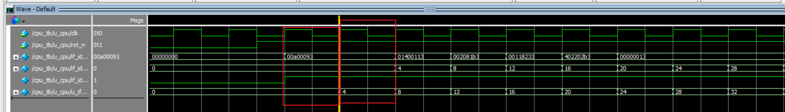

# 一、alu test

1、验证当前 CPU 实现的 **RV32I ALU 类指令功能是否正确**，以及边界情况，有符号/无符号比较，x0 写保护等

并且检查`mem_stall`、`load_use_hazard`、`redirect_valid`在测试期间应始终不出现

并且验证 整个 test 预期执行周期与实际执行周期是否一致

测试如下 case：

| Case | 测试内容                       | 验证目的                            |
| ---- | -------------------------- | ------------------------------- |
| 1    | `ADD 10 + 3 = 13`          | 基本加法                            |
| 2    | `SUB 3 - 10 = -7`          | 减法及负数结果                         |
| 3    | `SLL 10 << 3 = 80`         | 寄存器逻辑左移                         |
| 4    | `SLT -1 < 10 = 1`          | **有符号比较**                       |
| 5    | `SLTU 0xFFFFFFFF < 10 = 0` | **无符号比较**，与 SLT 区分              |
| 6    | `XOR / OR / AND`           | 基本位运算                           |
| 7    | `SRL 10 >> 3`              | 逻辑右移                            |
| 8    | `SRA -1 >>> 3`             | **算术右移**，检查符号位扩展                |
| 9    | `ADDI 10 + (-5)`           | I-Type 加法和负立即数                  |
| 10   | `SLTI / SLTIU`             | 立即数形式的 signed / unsigned 比较     |
| 11   | `XORI / ORI / ANDI`        | I-Type 位运算                      |
| 12   | `SLLI shamt=31`            | 最大移位量                           |
| 13   | `SRLI/SRAI shamt=31`       | 最大右移，同时区分逻辑/算术                  |
| 14   | `SLLI/SRLI shamt=0`        | 移位边界值 0                         |
| 15   | `LUI 0x12345`              | U-Type immediate 是否正确放到高 20 bit |
| 16   | `AUIPC`                    | 验证 `PC + U-imm`，本例得到 `0x1068`   |
| 17   | `SUB 0 - 1`                | 再验证负数/补码结果                      |
| 18   | `SRL/SRA 0xFFFFFFFF`       | 同一个负数分别逻辑右移和算术右移                |
| 19   | `ADDI x0,x0,123`           | **x0 写保护**                      |
| 20   | 连续 `ADDI` dependency chain | 顺便回归检查 ALU forwarding           |

2、sim
1、发现复位之后，第0个 inst 执行了两次，因为复位之后，预期第二拍，instr rdata 才能到达 if_id_instr，但实际上 第一拍的时候，if_id_valid 就立起来了，因此在 if1 实际上还未有效时，if/id 就执行了一次


2、发现 预期写回次数与实际写回次数 不一致，原因是 rtl 中，如果对 x0 发齐写回，由于写保护，wb_en 不会立起，因此实际写回次数会比预期写回次数少 1 次，是合理的，系Testbench 的预期有问题


3、修法

给 if1 reg 也增加 valid 栏位，指示 if1 指令是否有效，而后再传给IF/ID pipe reg


# 二、forwarding test

1、验证 **ALU 指令发生 RAW 数据相关时，CPU 能不能拿到最新的数据，而不是 RegFile 里的旧值**

有两条 forwarding 路径，

```
EX/MEM → EX
MEM/WB → EX
```

并且验证 整个 test 预期执行周期与实际执行周期是否一致，

以及整个过程中不能意外产生 memory access、load-use hazard 或 redirect

共验证了如下 case：

| Case | 场景                                     | 验证目的                          |
| ---- | -------------------------------------- | ----------------------------- |
| 1    | `ADDI x1,...` → `ADDI x2,x1,1`         | `rs1` 的 **EX/MEM forwarding** |
| 2    | `ADDI x3,...` → `NOP` → `ADDI x4,x3,1` | `rs1` 的 **MEM/WB forwarding** |
| 3    | `ADDI x5,...` → `ADD x6,x0,x5`         | `rs2` 的 **EX/MEM forwarding** |
| 4    | `ADDI x7,...` → `NOP` → `ADD x8,x0,x7` | `rs2` 的 **MEM/WB forwarding** |
| 5    | 两个 operand 分别依赖前面的不同指令                 | **rs1、rs2 同时 forwarding**     |
| 6    | 连续多次写同一个 `rd`，后面立即读取                   | EX/MEM 和 MEM/WB **同时命中时的优先级** |

全部 pass


# 三、load store test

1、主要验证 load 、store 的各种指令，

访存操作期间 mem stall 反压流水线，

连续访存是否会存在时序问题等

以及整个 test 预期执行周期与实际执行周期是否一致

并且验证 dmem 协议，即 mem req 发起，但 dmem 尚未ready 期间，req 要保持

| Case | 测试场景                     | 验证目的                                |
| ---- | ------------------------ | ----------------------------------- |
| 1    | `SW → LW`                | 最基本的写入再读回                           |
| 2    | `SW → SW → SW`           | 连续 Store 能否正确完成，不丢 transaction      |
| 3    | `LW → LW → LW`           | 连续 Load 能否正确完成                      |
| 4    | `SW → LW → SW → LW`      | Read/Write 连续切换                     |
| 5    | `SW → SB → LW`           | `SB` 只修改指定 byte，其他 byte 不变          |
| 6    | `SW → SH → LW`           | `SH` 只修改指定 halfword                 |
| 7    | `SB × 4 → LW`            | 验证四个 byte lane 和小端序                 |
| 8    | `SH × 2 → LW`            | 验证高/低 halfword 的 `wstrb`            |
| 9    | `LB/LBU/LH/LHU`          | 各种 Load 宽度、lane、符号扩展和零扩展            |
| 10   | `SW + SB + SB + SH → LW` | 不同宽度 Store 混合修改同一个 32-bit word      |
| 11   | `LW → SW → LW`           | Load 结果立即作为 Store data，验证相关处理       |
| 12   | `ADDI → SW → LW`         | ALU 结果立即作为 Store data，验证 forwarding |


2、遇到了一个 bug，MEM stall 持续多拍时，WB forwarding 会中途消失：

当前为 I1 在 wb，I2 在 mem，I3 在 ex，需要 I1 forward to I3 的 case，

而 forward 是组合输出，根据 wb_en 来判断是否有数据依赖，也就是说，mem/wb forward data 仅在 wb_en 立起时有效，而 I2 在执行 mem 操作，为多周期，但 wb 只有第一周期才 en，因此当mem 操作的最后一个周期，即 mem_ready 的时候，forward 早已经重新判断成不依赖了，所以下一周期 forward 失败，因此有 bug


3、修法是在 mem stall 期间，增加 hold forward 寄存器，使得 mem/wb forward data 在 mem_stall 期间可以 hold 住，等到 stall 解除后，能顺利送回 ALU input，完成 forwarding


# 四、load\_use\_test

1、验证前一条是 Load，后一条马上使用 Load 的 `rd` 时，Forwarding 来不及时，CPU 能不能正确检测 RAW hazard，并插入 1 个 Bubble

以及整个 test 预期执行周期与实际执行周期是否一致

比较实际发生 load\_use\_hazard 的次数，和预期会产生的次数是否一致

| Case | 场景                                           | 验证目的                                |
| ---- | -------------------------------------------- | ----------------------------------- |
| 1    | `LW → ADD`，依赖 `rs1`                          | Load-Use 对 `rs1` 的检测                |
| 2    | `LW → ADD`，依赖 `rs2`                          | Load-Use 对 `rs2` 的检测                |
| 3    | `LW → SW`                                    | Load 数据马上作为 **Store Data** 时也必须识别相关 |
| 4    | `LW → BEQ`                                   | Load 数据马上用于 **Branch 比较** 时必须 stall |
| 5    | `LW x0 → ...`                                | `rd=x0` **不能产生假 hazard**            |
| 6    | `LW → I-Type`，指令编码里的 `rs2` bits 恰好等于 load rd | 必须看 `use_rs2`，不能只比较指令 `[24:20]`     |
| 7    | `LW → 无关指令`                                  | 两条指令没有 RAW 时绝不能乱 stall              |


2、发现的问题，记录的产生 load\_use\_hazard 的次数多于预期产生 load\_use\_hazard 的次数，原因是 testbench 中记录   load\_use\_hazard 产生次数的方式有问题，原因是由于 load_use 发生的当下，可能有一个 instruction 正在进行 mem 操作，由于 mem 的多周期，要 stall 反压前流水线，并且由于 mem_stall 优先级最高，使得 load\_use\_hazard 会被 hold 住，导致 testbench 重复计数


3、由统计 load\_use\_hazard 信号产生的次数，改为统计 load\_use\_hazard 实际被执行，而使得 id/ex bubble 的次数


# 五、branch\_test

1、验证6 种 Branch 指令：BEQ/BNE/BLT/BGE/BLTU/BGEU
Taken / Not Taken 两种情况，是否能正常跳转
Branch 的数据相关，如 forward，以及 load-use
Taken 后 wrong-path 指令必须被跳过，不能误执行

以及 整个 test 预期执行周期与实际执行周期是否一致，redirect 次数是否符合预期

| Case | 场景                             | 验证目的                           |
| ---- | ------------------------------ | ------------------------------ |
| 1    | `BEQ` Taken                    | 相等时正确跳转                        |
| 2    | `BEQ` Not Taken                | 不等时顺序执行                        |
| 3    | `BNE` Taken                    | 不等时正确跳转                        |
| 4    | `BNE` Not Taken                | 相等时不跳                          |
| 5    | `BLT -1, 1` Taken              | **有符号小于**                      |
| 6    | `BLT 2, 1` Not Taken           | BLT 反例                         |
| 7    | `BGE 2, 1` Taken               | **有符号大于等于**                    |
| 8    | `BGE -1, 1` Not Taken          | BGE 反例                         |
| 9    | `BLTU 0xFFFFFFFF, 1` Not Taken | **无符号比较**，区分 BLT               |
| 10   | `BLTU 1, 2` Taken              | BLTU 正例                        |
| 11   | `BGEU 0xFFFFFFFF, 1` Taken     | 无符号大于等于                        |
| 12   | `BGEU 1, 2` Not Taken          | BGEU 反例                        |
| 13   | `ADDI → BEQ`                   | **ALU → Branch forwarding**    |
| 14   | `LW → BEQ`                     | **Load-Use + Branch compare**  |
| 15   | Taken Branch → Branch          | 后面的 **wrong-path Branch 必须被杀** |
| 16   | Not Taken → Taken Branch       | 第一条不跳不能误杀第二条                   |
| 17   | Not Taken → Not Taken          | 连续两个不跳都应正常执行                   |
| 18   | Taken Branch → SW              | **wrong-path Store 不能修改内存**    |


# 六、Jump Test

1、验证 JAL JALR 能否正常执行

 PC+4 是否如期写回

JAL JALR 与 older cmd 发生 hazard 需要forward，以及 load-use 能否按预期执行

jump 后的 wrong-path 指令必须被杀掉，不能误执行

以及 整个 test 预期执行周期与实际执行周期是否一致，redirect 次数是否符合预期

| Case | 场景              | 验证目的                             |
| ---- | --------------- | -------------------------------- |
| 1    | Basic `JAL`     | JAL target 是否正确，同时 `rd = PC+4`   |
| 2    | `JAL x0`        | 只跳转、不保存返回地址                      |
| 3    | Basic `JALR`    | `rs1 + imm` 计算 target，并写回 `PC+4` |
| 4    | JALR target 为奇数 | 验证 `target[0] = 0`               |
| 5    | `ADDI → JALR`   | JALR 的 `rs1` 能否使用 ALU forwarding |
| 6    | `LW → JALR`     | Load-Use stall 后再进行 JALR         |
| 7    | `JAL → JAL`     | 第一条跳转后，wrong-path JAL 必须被杀       |
| 8    | `JALR → JAL`    | JALR 后面的 wrong-path JAL 必须被杀     |
| 9    | Jump → `SW`     | wrong-path Store 不能产生内存副作用       |


# 七、Integration Test

执行一段有实际意义的程序，涉及到 RV32I 大部分指令，验证能否按照预期执行

```
a = 10;
b = 20;

mem[0x100] = a;
mem[0x104] = b;

x4 = mem[0x100];
x5 = mem[0x104];

sum = x4 + x5;          // 30

if (sum == 30) {
    result = func(sum); // function 返回 31
}

mem[0x108] = result;

if (mem[0x108] == 31) {
    ...
}
```

包含了如下场景：

| Case | 场景                 | 验证目的                               |
| ---- | ------------------ | ---------------------------------- |
| 1    | `SW → LW`          | 数据能正确写入并读回                         |
| 2    | `LW → LW → ADD`    | Load 数据参与后续计算，包含 Load-Use          |
| 3    | `ADD → BEQ`        | ALU 结果参与 Branch 比较                 |
| 4    | Taken `BEQ`        | 正确跳转并杀掉 wrong-path 指令              |
| 5    | `JAL` 调函数          | 跳到 function，同时保存 `PC+4`            |
| 6    | function 中 `SW/LW` | 跳转之后访存仍正常                          |
| 7    | `LW → ADDI`        | function 内再次验证 Load-Use            |
| 8    | `JALR x0,0(x8)`    | 使用 JAL 保存的返回地址返回                   |
| 9    | 返回后 `SW → LW`      | 返回主程序后继续正常访存                       |
| 10   | `BNE` Not Taken    | Not-Taken Branch 正常顺序执行            |
| 11   | `JAL x0`           | 无 link 的直接跳转                       |
| 12   | Wrong-path ADDI/SW | 错误路径不能产生 architectural side effect |


# testbench 放在同目录下，验证波形均保存在 ../../sim/cpu 中


